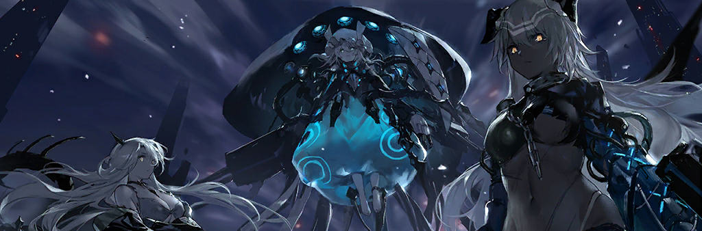

# RWR碧蓝航线Mod

## About
本mod基于碧蓝航线手游与制作者游玩RWR的经验制作。玩法轻量偏向于RWR。
死亡惩罚极低，请保证有足量的rp用于复活购买装备。
玩服务器的朋友看这里

↓↓↓↓↓↓↓↓↓↓↓↓↓↓↓↓↓↓↓↓↓↓↓↓↓↓↓↓

imba服务器 QQ群：`837341470`

↑↑↑↑↑↑↑↑↑↑↑↑↑↑↑↑↑↑↑↑↑↑↑↑↑↑↑↑

---
## 阵营
### 碧蓝航线阵营：
由大部分舰娘阵营组成的军事组织 X
指挥官在港区开的后宫√ （布里扳手警告）

### 余烬阵营：
当事物的性质向着META进行变化时，这一过程被称为META化。META，即「元」。
根据我们的了解，META是一种趋势，也是一种性质。是变化的过程，也是变化的结果。
当事物的性质向着META进行变化时，这一过程被称为META化。
心智魔方可以META化。基于META化的心智魔方可以诞生出META化的舰船。
舰船亦可以META化，基于自身心智魔方的META化转变为META化的舰船。
基于META化心智魔方建造出的META化舰船，其META化程度是不可逆的，至少目前没有发现任何逆转的方式。
基于舰船转化为的META化舰船，其META化在一定限度内是可逆的，目前拥有多种成熟的处理方式。
心智魔方META化的尽头，就是「元魔方」。
而舰船META化的尽头，则是————

### 塞壬阵营：
塞壬来源自古老的希腊神话传说，在神话中的她被塑造成一名人面鸟身的海妖，飞翔在大海上，拥有天籁般的歌喉，常用歌声诱惑过路的航海者而使航船触礁沉没，船员则成为塞壬的腹中餐。
塞壬（Siren）又名“安蒂克斯” 音译Anti-X，简便的的系统程序。元世界中人类用于取代舰娘的产物？

小黄鸡什么时候出塞壬捕获？！你得快点，不然我自己做了.JPG

## 开发人员
主程序：amemliky
小人建模：amemliky JR.50 jbhjs MelonDove WS
hud：amemliky xiexing
音效：amemliky XM117
武器护甲数值：amemliky
部分武器动作：PPSH-41 amemliky

给我狠狠的坐牢码代码.JPG

## 致谢
ppsh-41 xm117 Bad_Goose 异向易位制作组

遇到什么bug或者觉得数据不平衡请在下方留言或者加入 QQ群 747797095

---
本MOD已为开服做了相关适配，运行laolu.as 脚本即可。（大概能行）

单机作弊码/rp /promote /tank_0 /tank_1 /tank_2 /ice

更新日志自行查看（如果写了的话
